Todo:
Modernize dotnet
create pipeline
deploy to azure

Dr Migrate learning

# Objective
To have an overview of a large scale migration

The migration is usually conducted in three four steps:
Assessment + Business Case + Migration + Continuous Optimization

Assessment is critical because it will allow us to understand the landscape
Building a business case enable a conversation that helps us prioritize and set objectives: critical step to be able to prove value and show progress

Migration require from multiple teams: Application Owners, Central IT, Security, etc

Migration is over once the objective have been accomplished, and not necessarily when a migration is completed

## Understand our lab environment
The lab simulates a datacenter, by having a VM hosting server, and several VMs inside simulating different applications

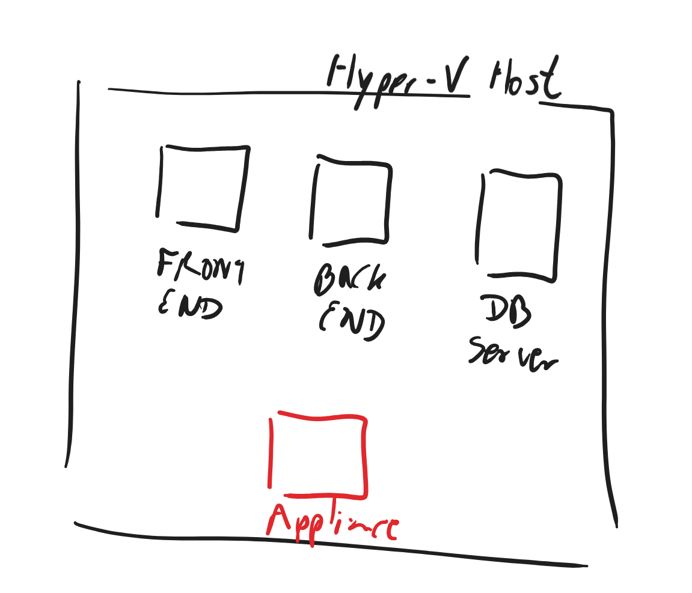

There are many tools that can help us do an assessment. 
On one hand we can simply use the current information the Application Management System the customer have.
Microsoft can support customers with licenses for Dr MIgratie
Microsoft also has two first party tools that allows you to do assessment. These tools are part of Azure Migrate service:
- Azure Migrate Collector
- Azure Migrate Assessment

Azure Migrate collector is a lightway local-only tool that gets metrics from the VM where it is running
For this lab, we will use Azure Migrate Assessment tool. 
In a datacenter it will connect to the VMWare VCenter or Hyper-V console and extract information of all running VMs, then we can provide credentials for those VMs and services (Like SQL Server Admin). If we do so, it will be able to provide centralized detailed information on the current state of the datacenter.
With that data we can later on, in a next step, build a business case and set appropriate objectives for a migration.
For this lab, there is already a Hyper-V VM, hosting several VMs that simulate a different applications in a datacenter.
First, let;s familiarize and explore the VM we will run the assessment on:
1. Go to the Azure portal and log in with the credentials that you can find in ...
1. Find the VM, in the resource group
1. Open RDP ports
1. Login to the VM with the following credentials
1. Open Hyper-V management

In there you will see three VMs, a Backend, a Database and a Front end.
Lets open the application to see it running. For that you can:
1. Find the IP of the application
1. Open the browser
1. Open the App
1. Do somthing with the app

## Create Azure Migrate Project
Now we will create an Migrate Project on Azure. This will be the hub that we will use to visualize and execute the migration
It is recommended to only create one project for your entire datacenter
1. Open the Azure Portal
1. Open the search bar in the top
1. Enter Azure Migrate
1. Create a new project
1. Select the region. This region is where all the metadata and collected data will be stored
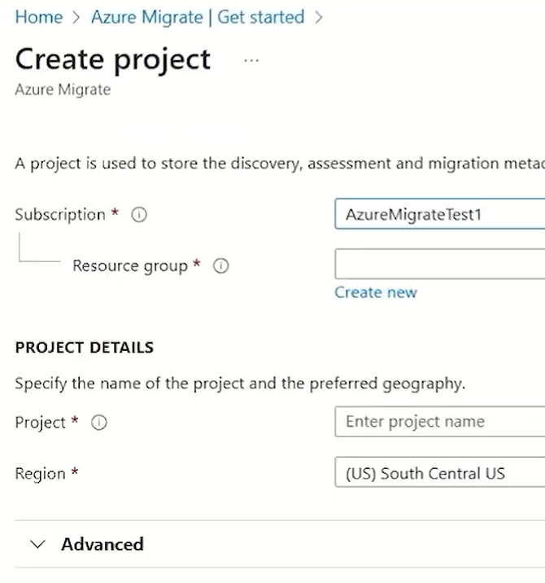


## Run the assessment tool
There are two ways we can run the assessment. We can either download and install the software, or we can directly download a Virtual Machine Hard Drive (VHD file) and install it in the Hyper-V host as a VM. We will follow this second approach
1. Open the azure portal
1. Open the Migrate Project
1. Go to the assessment link
1. Select Hyper-V
1. Give the appliance a name and generate the Key as shown in <1>
1. For this lab, we will use the VM Image, select VHD
1. Right click on the download button <2> and copy the link. We are not going to download it here, but inside the VM instead


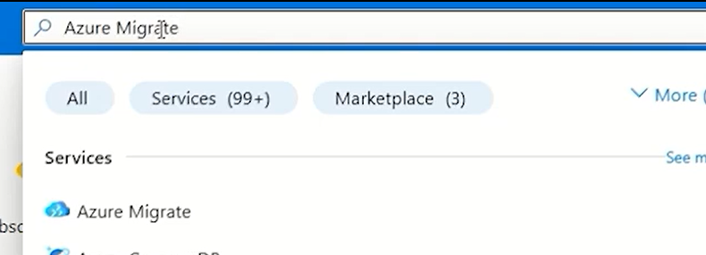
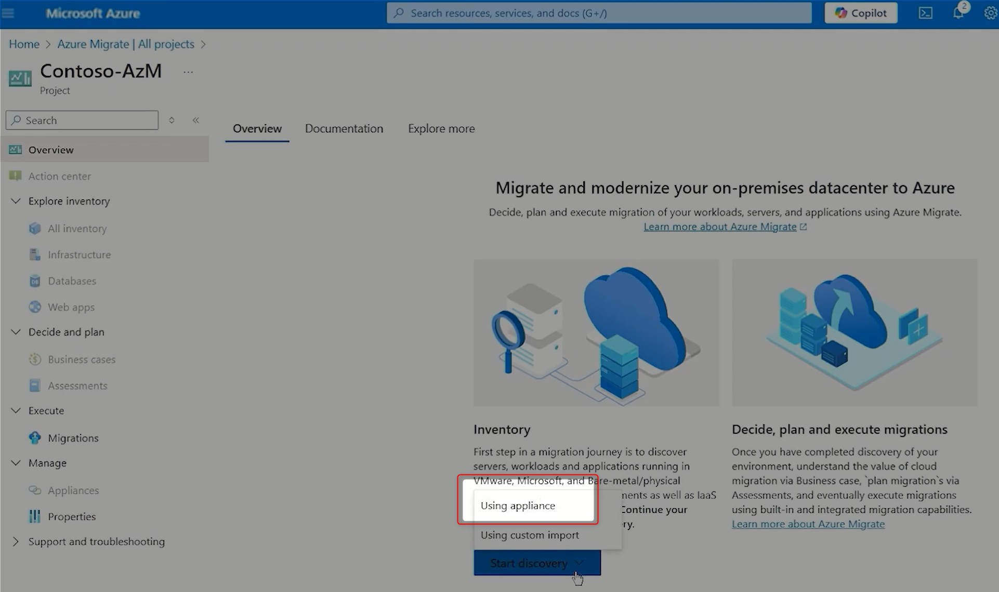
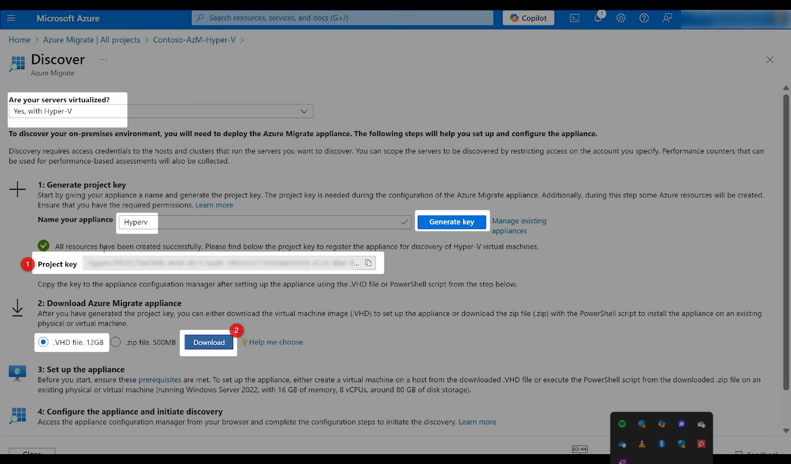

## Connect to your Hyper-V host and install the appliance
1. RDP the Hyper-V host
1. Donload the VHD using the link you copied before
1. Unzip
1. Go to Hyper-V, create new vm
1. Set the VHD as disk
1. Run the VM
1. Double click your appliance VM, and create and admin password
1. Open the link in the desktop
1. Upgrade the appliance
1. Paste the key and verify it as shown in <1>. This will link this appliance with your Azure Migrate project
1. Login to Azure using your portal credentials. This will gran the appliance permissions to send metrics to your azure Migrate project

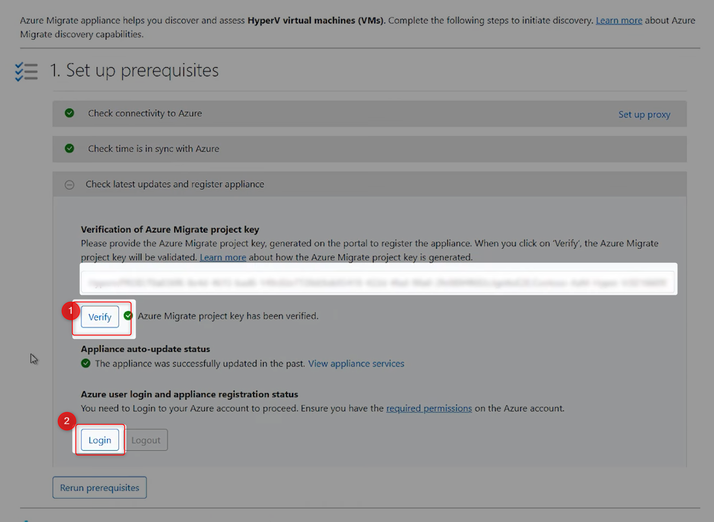

## Connect the appliance to your Hyper-V host
Now we will configure the appliance to connect to the Hyper-V host
1. In the Provide Hyper-V Host credentials tab, click in Add Discovery Source
1. Provide a friendly name for the hyper-V host
1. Add the username and password that you used to authenticate to the hyper-v host VM
```
username: demouser
password: demo!pass123
```

The credentials are stored in the appliance only, and they are stored using Windows DPI API


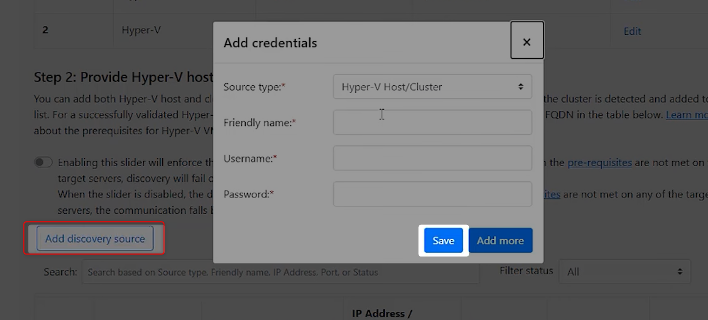

## Provide your Hyper-V connection details
Now we need to tell the appliance where to find the hyper-V host
1. Click in Add Discovery Source in the Provide Hyper-V Host Connection Details tab as shown by <1>
1. Add the IP of the host. For this lab it is `172.0.10.1`


In order the appliance can discover databases and DotNet applications, it need to be able to access the different VMs inside Hyper V
For that we will provide such credentials as follow:
1. Click in Add Credentials
1. In Credential Type, select Windows (no domain)
1. Add the following credentials

```
username: Administrator
password: demo!pass123
```

For our SQl server, do the same adding the following credentials:
```
username: sa
password: demo!pass123
```

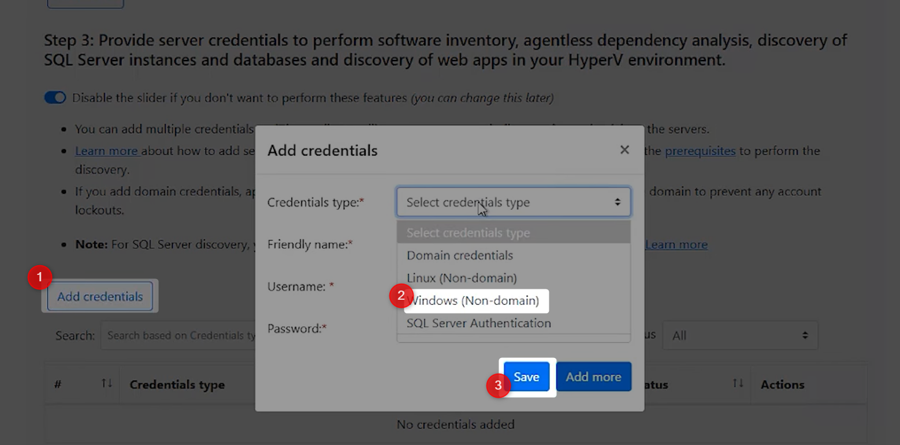

## Analyze the datacenter discovery
In this section we will explore the Azure Migrate findings, and start the business case analysis for the migration

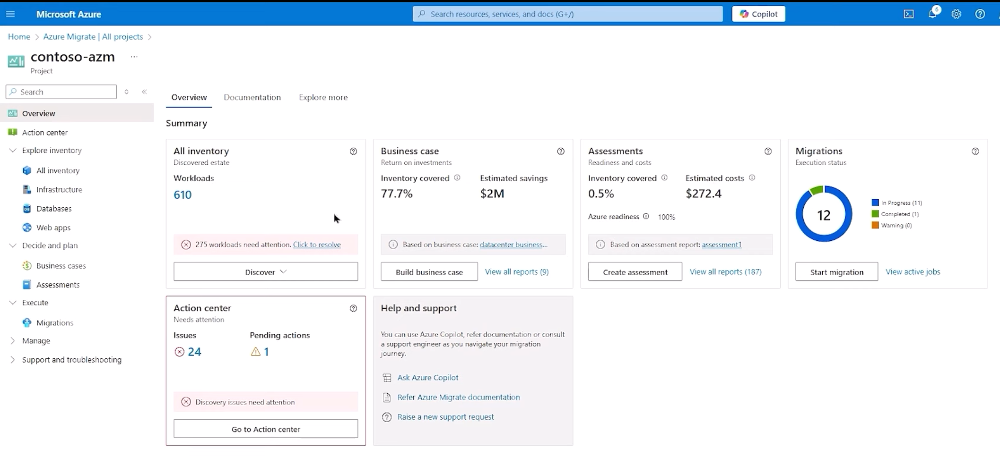

After the analysis, the first thing that we will look at is the worloads that have been discovered.
In the All Inventory box, we can click in the number of workloads that have been discovered.

That will take us to the `All Inventory` tab, where we will be able to see hierarchically the different workloads that have been discovered

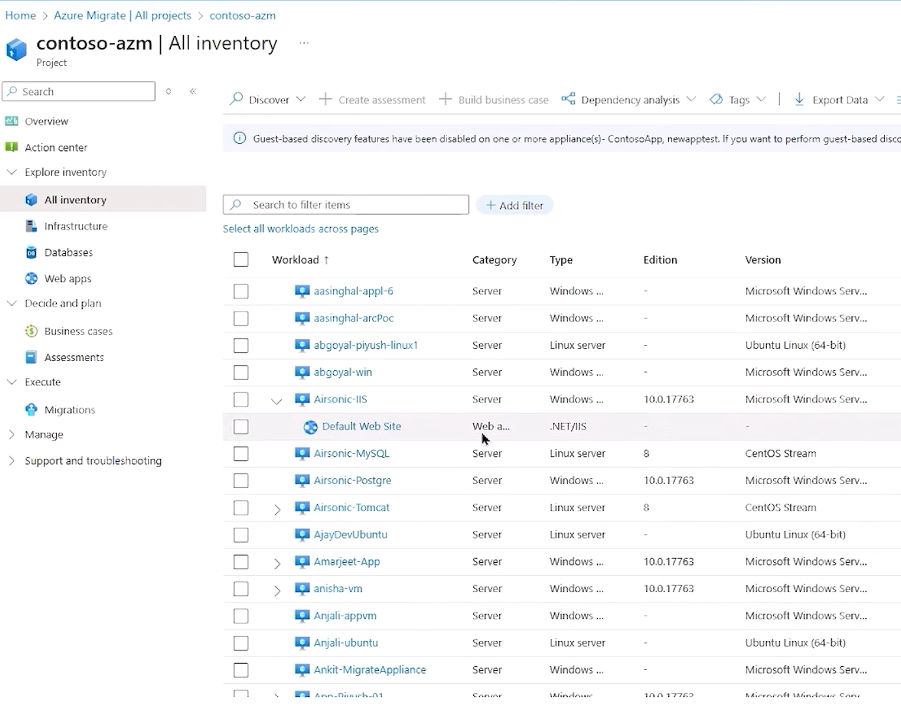

### Tagging workloads

By default, Azure migrate will find dependencies and try to relate workloads.
We can also tag workloads together, using the new tagging feature.
Go ahead and tag the different servers from the same workload as shown in the picture

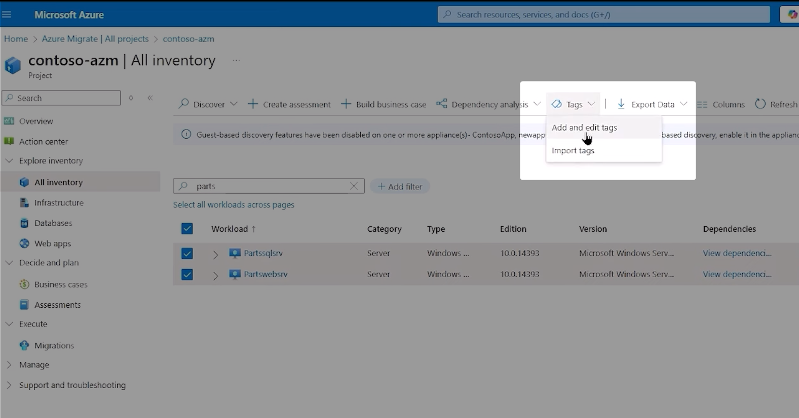

Now lets explore the software inventory, to fin out the purpose of the server

1. Go to your Azure Migrate project.
2. Select "Servers, databases and web apps".
3. Click "Discovered servers".
4. Choose a server and open its details.
5. Under "Software inventory", review installed applications and versions.

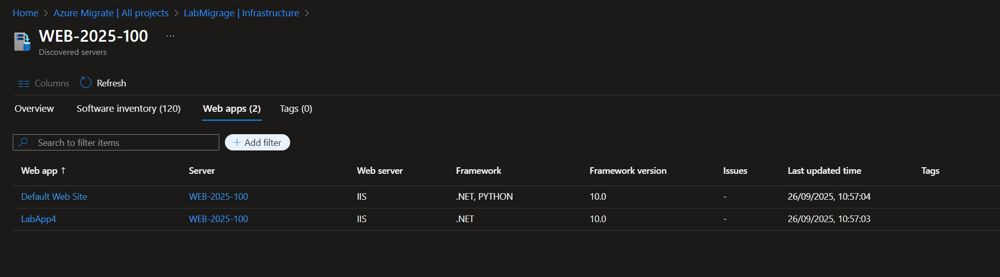